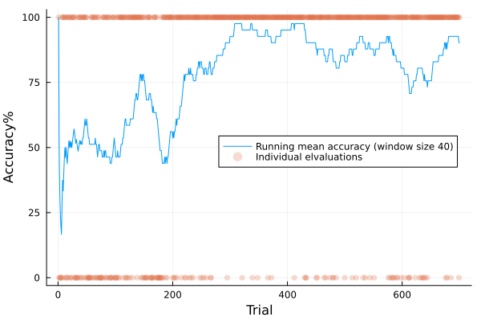

# SynapticBlox.jl

This is a GraphDynamics.jl-based implementation of the [corticostriatal model](https://www.biorxiv.org/content/10.1101/2023.11.06.565902v3). 
In this version of the model, synaptic data no longer lives in the presynaptic neuron and are now split out into their own "Synaptic Blox" which can be thought of a bit like dynamic connections. 

See examples of running it in [test/corticostriatal_model_runs.jl](test/corticostriatal_model_runs.jl). 

It currently appears to be able to reproduce the same learning behaviour as the old version that used ModelingToolkit, but is approximately ~10x faster per learning trial for the big version of the model. This should also be more scalable to large problem sizes, and will support dynamically adding and removing connections.

This repo is unstable and can have major changes. It's mostly just a staging ground to integrate new ideas into mainline Neuroblox.jl
